# 中文版说明

## LiftSheet是什么？

这是一款**功能强大且高度现代化**的力量训练计划表格模板，旨在为力量举教练、力量训练者打造一个最强大的**训练规划和数据追踪系统**

LiftSheet不提供预设训练计划，而是作为您的**训练计划管理中枢**，让您能够：

- 获得科学完备的**周期性训练计划编排表格**。
- 使用**多维度的数据统计图表**，全面量化追踪训练进度和表现。
- 享受**高度自动化的重量调节器**，训练内容具备高度实时性。
- 集成**多个强大的计算器**，并内置**侧边栏 AI 对话功能**。

告别原始的纸质笔记和粗糙的 Excel 表格！LiftSheet 将是您在力量训练领域，超越传统、实现高效管理的**终极工具**。

## LiftSheet为什么会诞生？解决了什么问题？

LiftSheet 的灵感和基础源于作者与线上教练的合作经历。在力量举领域，Google Sheets 似乎已经成为线上训练计划的工具共识。我非常感谢这些教练，他们让我深刻认识到训练计划的构建、数据统计和量化分析的重要性。

LiftSheet 最初的定位，是对教练 Program 表格的优化和拓展，让我用的更舒服、更方便，数据的管理更直观细致。

后来，我开始使用LiftSheet为我的朋友编写训练计划，这时我开始着迷于优化Program和训练数据管理的工作流，而主要的工作其实就是构建出一个更强大的LiftSheet，一个好到应该被更多人使用的训练计划管理工具。

**健力与赛车很像：它更多是关于 “如何打造一辆更快的赛车”。通过量化数据的优化，训练者可以取得持续的进步。稳定持续的进步是可以被精准规划的，前提是在适合自己的数据范围内进行不断的训练和调整。**

**LiftSheet不是一个具体的产品，而是一项概念。其本意是鼓励每一位专注且有洞见的训练者，去搭建自己的训练规划和数据追踪系统。与其说让各位对这里已有的工作满足，我更希望用LiftSheet带来一点点启发，让你能DIY出最适合自己的工具。**

对于教练或自己写计划的朋友，不妨试试使用这一套工具来编写你的内容。我相信计划的内容与保存计划的形式是相辅相成的，一本小笔记本容纳不了多么科学量化的训练计划，而一个强大的工具其实能拓展我们对于内容的理解和思考。

对于使用教练计划的训练者，你可以把教练的内容导入到自己的计划管理系统中。即使有教练的帮助，我们仍然需要学会为自己的进步负责。与其仅仅依赖教练解决问题，更重要的是通过数据和工具增强对自身的认识和理解。这是实现长期、稳定进步的关键。

## 现在获取LiftSheet

获取链接：

https://docs.google.com/spreadsheets/d/1WWuxLfXI7AO76t5O3h6kk3mLbQxAL21nihzzK85FBdw/edit?usp=sharing

在浏览器输入链接或直接点击跳转

选择Make a copy, 复制到自己的GoogleSheet表格库中，就可以愉快地使用啦！

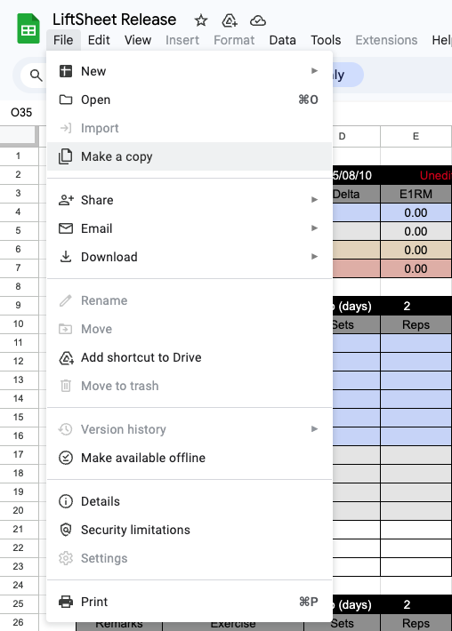

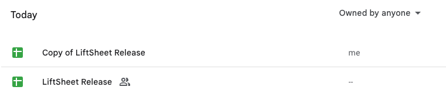

## 看了这个故事，你就知道怎么用！

### 1.写入计划

你是教练Taylor,现在你要给你的学员Susan编写M1B1W1D1(Mesocycle1-Block1-Week1-Day1)的训练计划。

首先确定Susan的M1B1采用4次的周训练频率，因此你从三种频率模板中，找到了🗓️**M1B1 (4Days）**，然后右键点击🗓️**M1B1 (3Days）和**🗓️**M1B1 (5Days)**把它们隐藏了

打开🗓️**M1B1 (4Days）**，你将W1D1的日期设置为2025/08/05 Tuesday，接着把Gap(days)设置为2，此时表格已经自动将下个训练日的日期改为了2025/08/07 Thursday，即间隔两天。

现在你要填入计划了：主项Main Squat动作Competition Squat内容是Top single@RPE7; Working Set: 4*5@RPE6；

接着你需要计算出Susan的1*1@RPE7的目标重量，于是你打开了🔢**calculator**在RPE Weight Calculator中填入预估1RM 120、RPE7、 1rep，然后得到了107.5

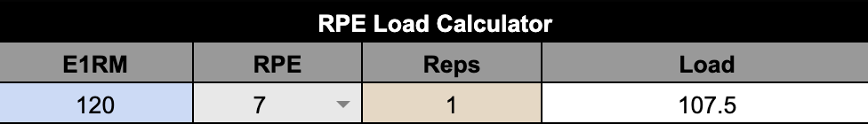

将107.5输入到W1D1第一行空白的Target load，Working set的重量马上根据内容自动出现了，你的工作已经差不多完成了，右边的内容就需要Susan训练后填写记录了

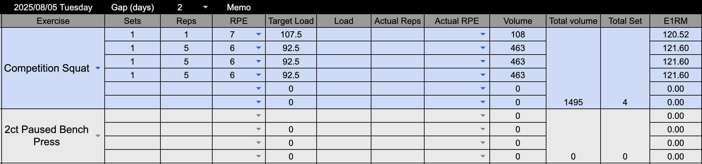

同时你注意到，表格还自动统计了组数、容量、本周最大重量、预估1RM等数据，且Delta还反映了与上周的差值（第一周没有Delta)；

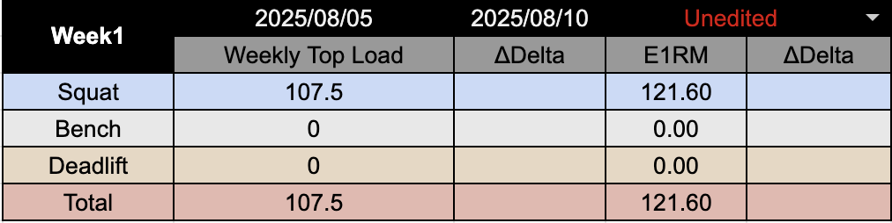

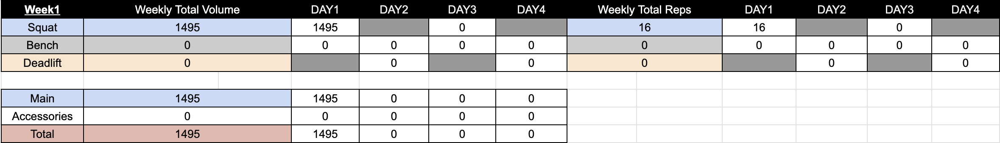

****

### 2.执行与记录

Susan拿到了计划，她首先打开📈**Weight Tracker**记录了当天的体重

接着，她打开了🔢**calculator**在Warm Up Calculator中输入Target load 107.5 1rep RPE7,得到了五组的热身重量建议

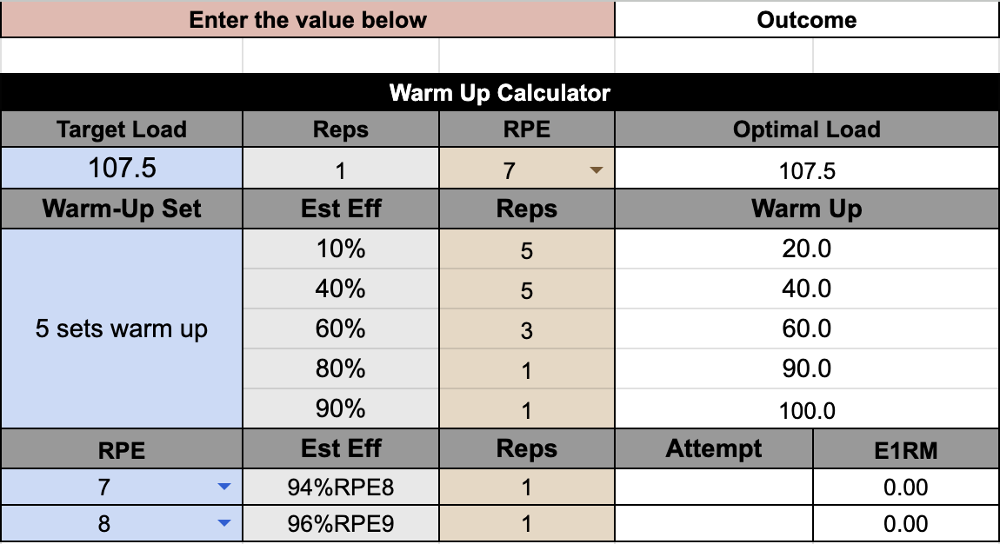

“如果是冲击RPE9重量115kg的话，热身重量又是多少呢？”Susan想，填入计算器后，她得到了答案：

“真实情况往往没有那么理想，要是试举RPE7时，发现RPE已经到达8怎么办呢？”Susan又陷入了思考，她尝试把左下角107.5Attempt的RPE选择为8（记得下次计算改回7哦）然后发现，右边的推荐Load从115变成了110,意思是今天的RPE9重量应该是110“这也太智能了吧！”Susan不禁赞叹

回到W1D1的训练，再最后一组热身后，Susan觉得状态不好，因此把topset使用了105kg，RPE正好是7！于是在Actual PRE中选择了Optimal（或者手动选择RPE数字）

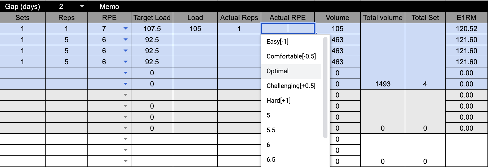

接着惊喜地发现，Target load根据变化，从92.5下降为了90；并且表格自动填入了Actual Reps = 1, 并输入了下一个重量（如果选择数字RPE则需要手动填写Actual Reps和下个重量）这样，Susan只需要每组结束后，动动手选择RPE，就能填好一次训练记录了

与此同时，统计模块也根据现实情况更改了数字

****

### 3.训练数据的统计分析

Susan完成了今天的深蹲训练，现在我们来尝试进行数据的统计分析

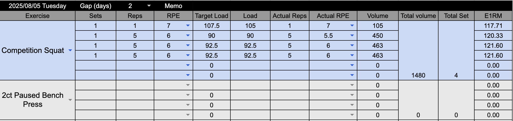

打开**📈Performance Tracker**表格，这里暂时还没有数据，但请不要急着从🗓️**M1B1 (4Days）**表中抄录数据！！！

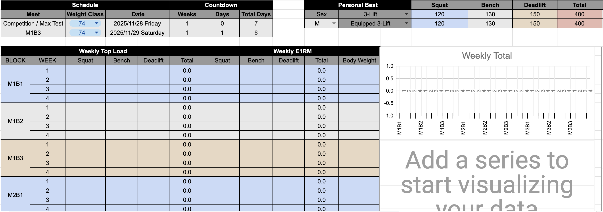

作者在这里制作了脚本以一键迁移统计数据，如图点击表格上方菜单栏Help的右边有一个“MyScript”的按钮，选择Sync Performance Data运行脚本

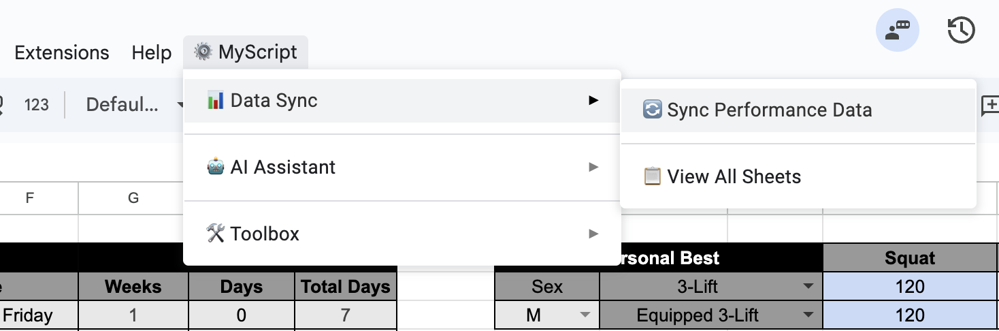

按照提示输入目标Block，输入M1B1（模糊查找）或复制粘贴完整工作表名称🗓️**M1B1 (4Days）**

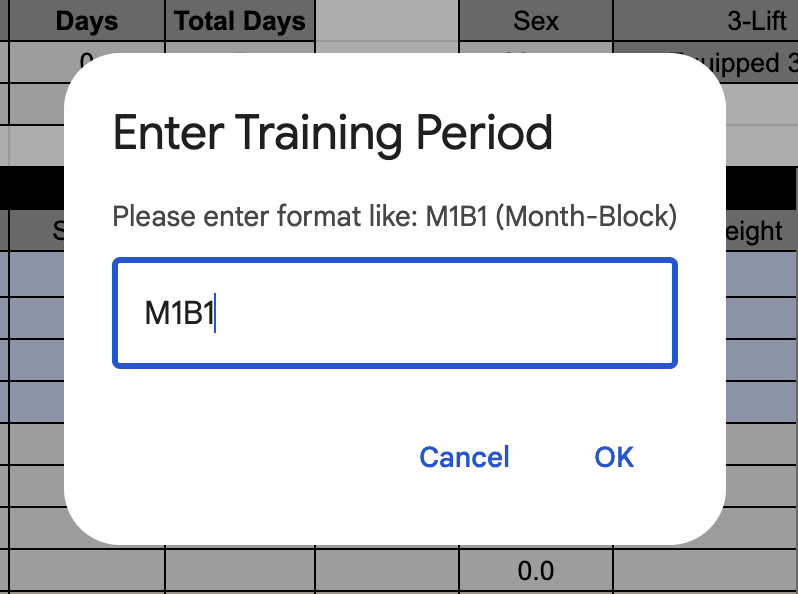

由于脚本找到了三个不同的M1B1表，因此我们需要输入2,选择第二个🗓️**M1B1 (4Days）**

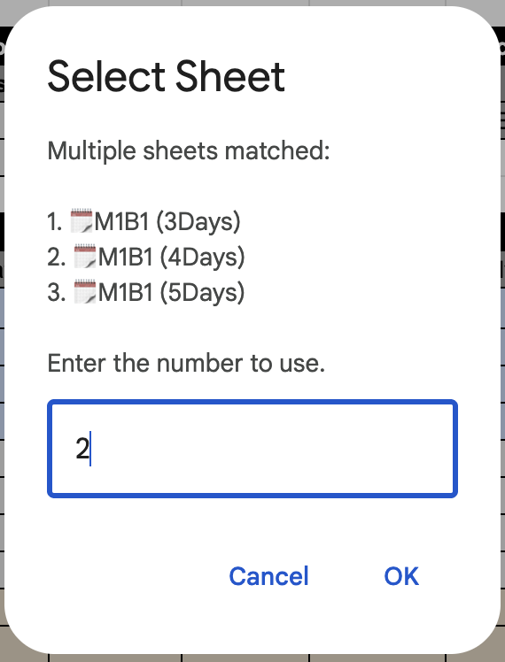

确认后提示数据同步完成了

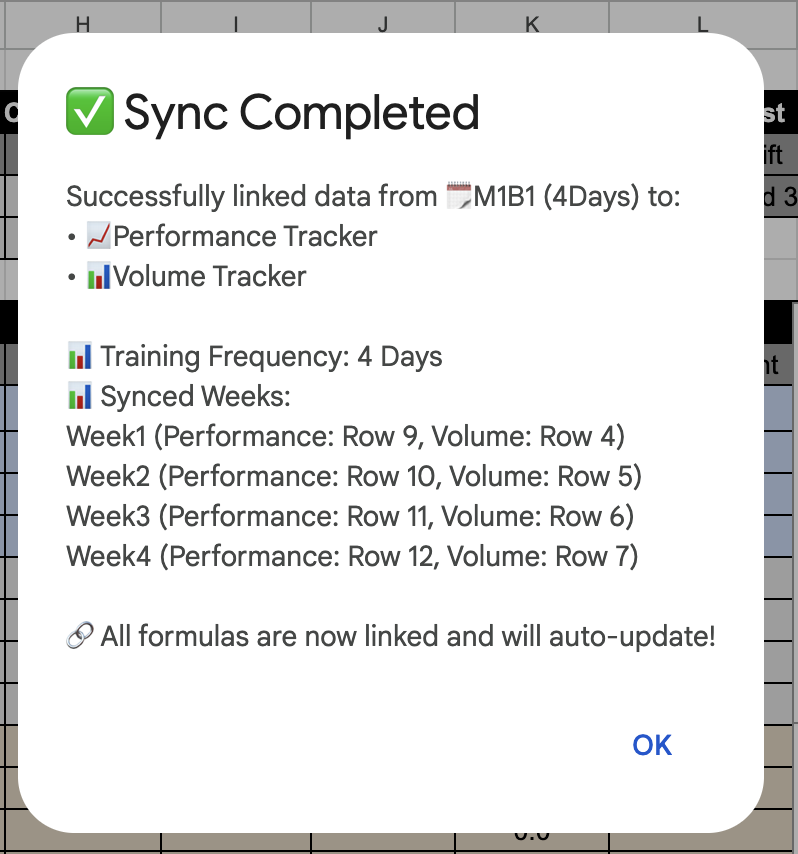

此时M1B1的数据已经同步到**📈Performance Tracker**表中了，图表也显示了；由于使用的是链接单元格的方式非填写具体数字，所以后续M1B1的数据就不需要重复进行同步了

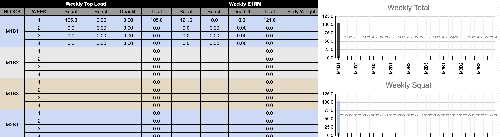

打开另一个统计表**📊Volume Tracker**发现M1B1也已经显示了

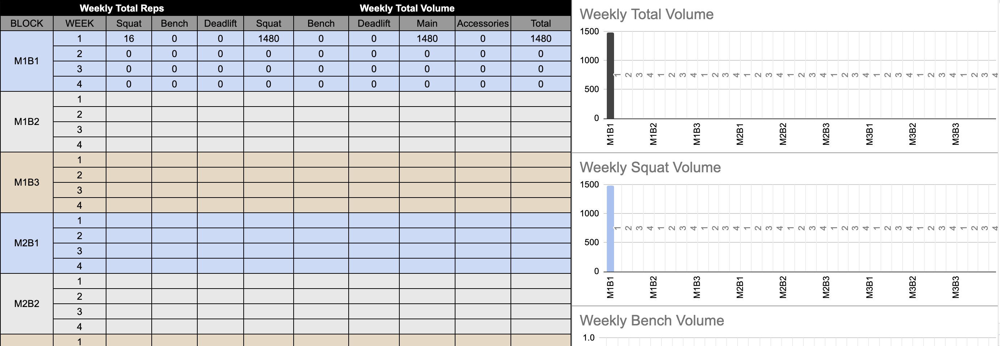

****

### 4把表格变成你自己的样子

#### 4.1如何加入你喜爱的动作

以**SSB Squat**为例，点击钢笔编辑图标

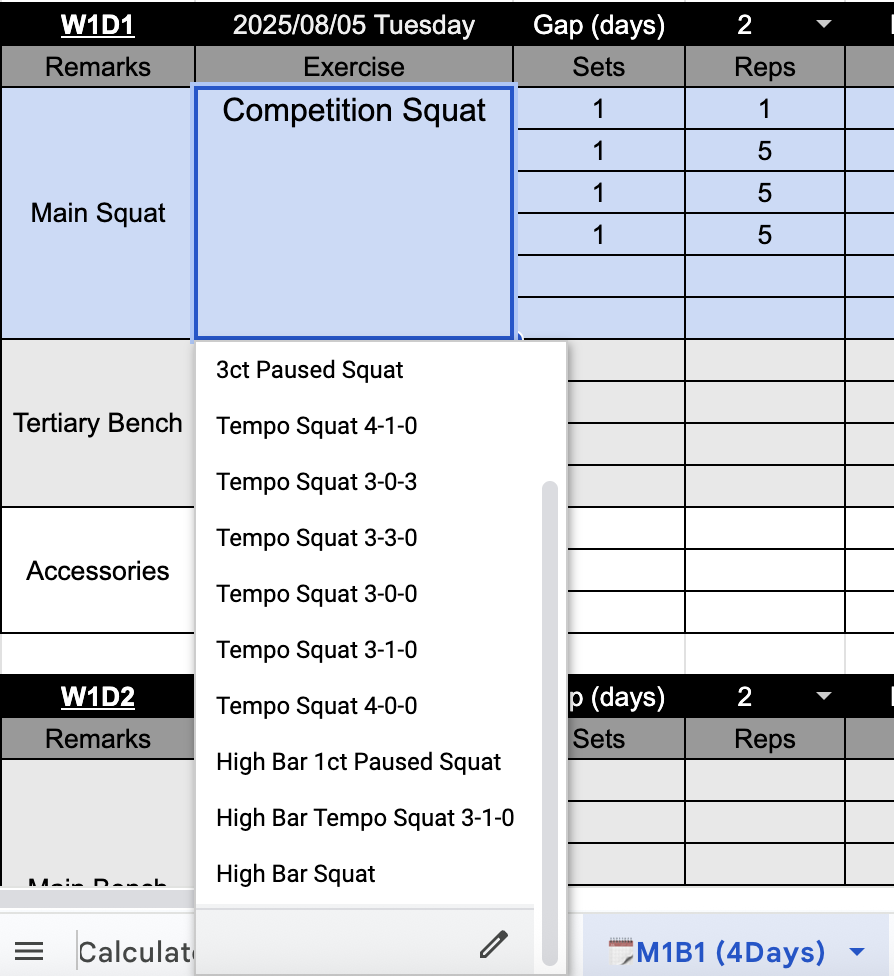

右边会弹出编辑栏，选择Add another item来增加一个新动作，填入后选择done、Apply to all即可

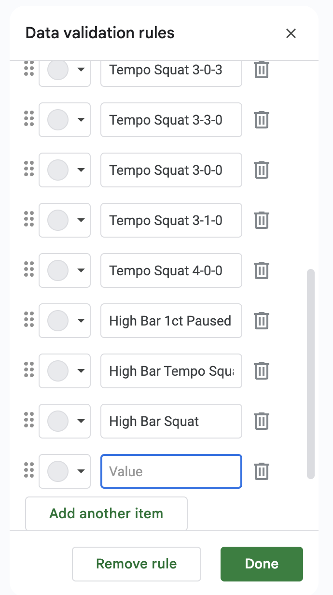

#### 4.2创建新Block

M1B1结束，要开M1B2了？事实上🗓️**M1B1 (3Days）**、🗓️**M1B1 (4Days）**、🗓️**M1B1 (5Days）**是三个模板表，后续表都可以通过复制模板表得到，并完全保持原有的所有功能

#### 4.3自定义周训练结构

首先按照您的训练频率，复制一份模板表，在新复制的表中进行调整

在模板中，每周的训练内容都是三个板块：主项、次主项、辅助项训练，它们可以完全拆分独立，根据需要调整组合方式和前后顺序

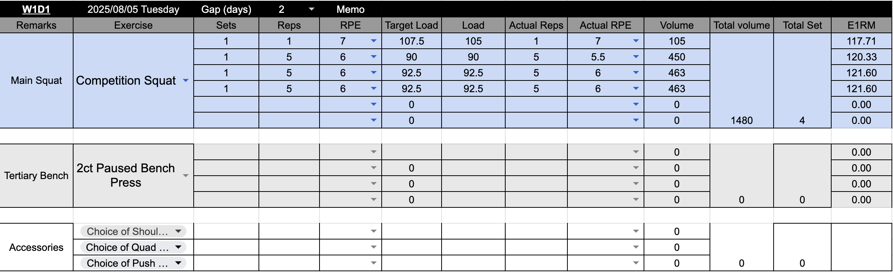

Googlesheet的一个重要特性是：在同一个表中拖拽、剪切来移动单元格，单元格的映射关系会动态适应位置的改变

举例我希望Day1深蹲后的次主项是硬拉而非卧推，先选中不需要的卧推板块剪切到别处

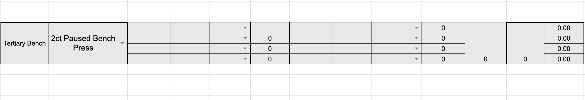

选中Day2的硬拉板块，剪切粘贴到深蹲下方

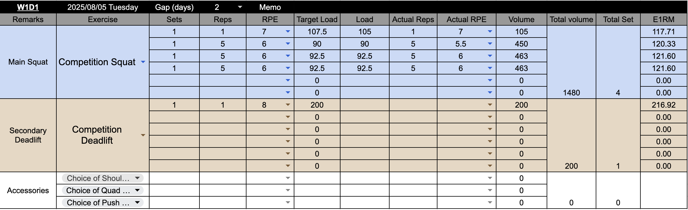

在表格底部的统计板块根据变化重新排列一下数据，仍然使用剪切或拖拽，不更改表格内容（如果要改也不难，用=引用计算好的容量数据即可）

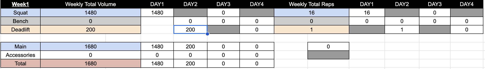

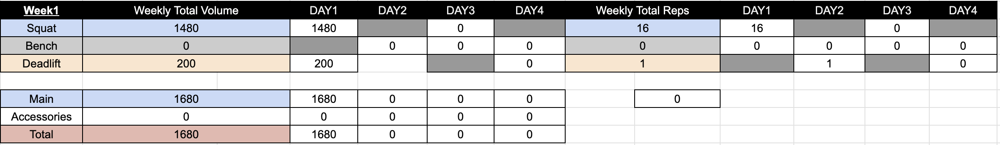

Week1的结构调整好后，整个复制到Week2、Week3即可

****

### 5.进阶使用

#### 5.1侧边栏AI对话

首先选择Configure API key配置deepseek API

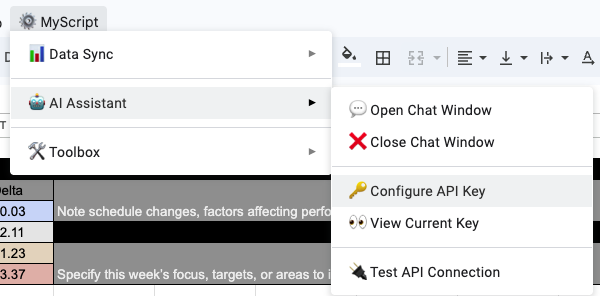

然后就能选择Open Chat Window打开对话侧边栏

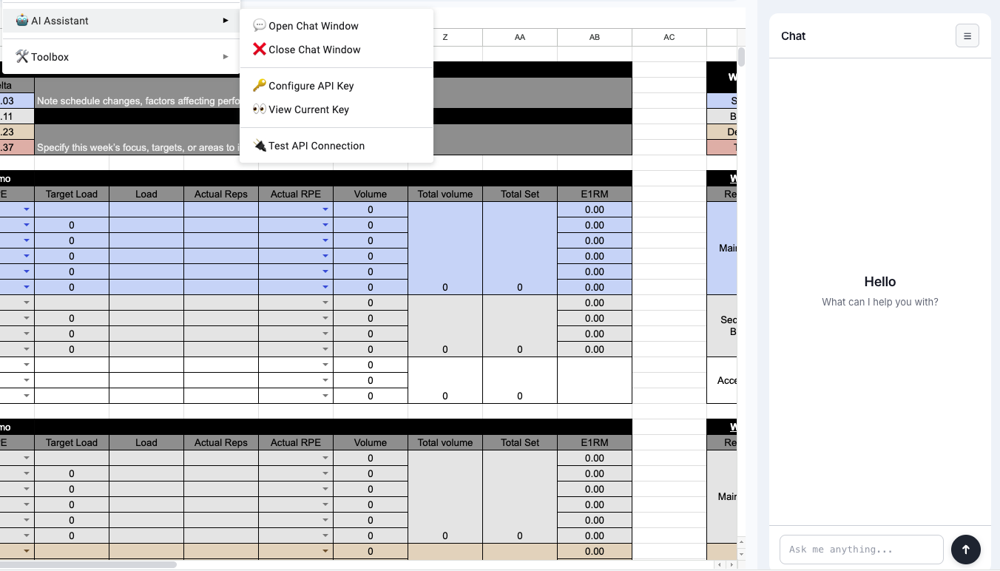

可以利用AI对话功能分析训练数据、根据已有训练内容规划一下步安排等

主要解决传统AI应用无法直接获取表内数据的问题

#### 5.2Plate Loading Calculator

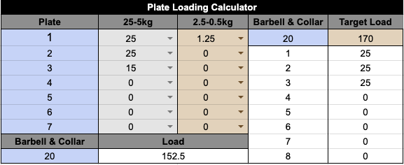

左侧用于计算加片所得重量，25-5kg栏添加大片重量，2.5-0.5kg栏添加小片重量，Barbell&Collar下输入杠铃+卡扣重量

图中例子：杠铃20kg，每边加了两片25kg、一片15kg以及一片1.25kg小片，得出结果总重量152.5kg

右侧用于计算目标重量的加片选择

图中例子：杠铃20kg，目标重量170kg，得到结果每边加3片25kg

#### 5.3Powerlifting IPF GL Points Calculator

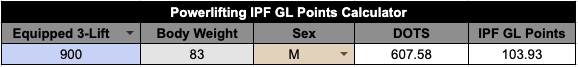

#### 5.4Taper Calculator

