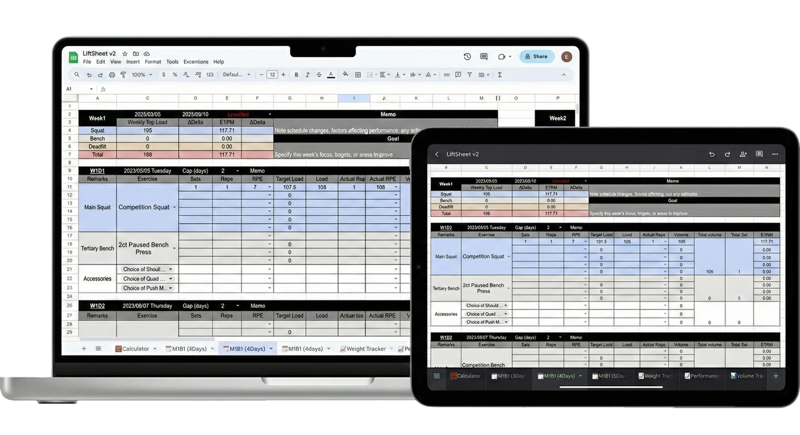

# LiftSheet [English](README.md)

## LiftSheet是什么？

这是一款**功能强大且高度现代化**的力量训练计划表格模板，旨在为力量举教练、力量训练者打造一个最强大的**训练规划和数据追踪系统**

LiftSheet不提供预设训练计划，而是作为您的**训练计划管理中枢**，让您能够：

- 获得科学完备的**周期性训练计划编排表格**。
- 使用**多维度的数据统计图表**，全面量化追踪训练进度和表现。
- 享受**高度自动化的重量调节器**，训练内容具备高度实时性。
- 集成**多个强大的计算器**，并内置**侧边栏 AI 对话功能**。

告别原始的纸质笔记和粗糙的 Excel 表格！LiftSheet 将是您在力量训练领域，超越传统、实现高效管理的**终极工具**。

## LiftSheet为什么会诞生？解决了什么问题？

健力和赛车很像，关键不在于一时的表现，而在于如何通过量化与优化，让“机器”持续变快。只要在适合自己的区间内反复训练与调整，稳定进步完全可以被规划。

LiftSheet 不是成品工具，而是一种鼓励训练者自行搭建体系的概念。我希望它带来的不是现成答案，而是启发——让每个专注训练的人都能DIY出最适合自己的计划管理方式。

对教练或自我编程的人来说，这套工具能提升计划书写的质量；强大的系统能装下更多科学、量化的内容，也能让你思考得更深入。

而对接受教练计划的训练者，把教练内容导入自己的系统同样重要。即便有教练，我们也需要学习为自己的进步负责，用数据增强自我理解，这才是确保长期稳定提升的关键。

## 现在获取LiftSheet

获取链接：

https://docs.google.com/spreadsheets/d/1NL3w-Peuepj49wIi83sbfOzNWiHEbX3nnhz_MV23wzE/edit?usp=sharing

在浏览器输入链接或直接点击跳转

选择Make a copy, 复制到自己的GoogleSheet表格库中，就可以愉快地使用啦！

## 看了这个故事，你就知道怎么用！

### 1.写入计划

教练Taylor要为Susan制作 M1B1W1D1 计划。他先确认这一周期采用每周4次训练，于是只保留`🗓️M1B1 (4Days)` 模板并隐藏其他频率。

进入模板后，他设定 W1D1 日期和训练间隔，表格会自动生成后续的训练日。

打开`🗓️M1B1 (4Days)` ，他设定 W1D1 日期和训练间隔，表格会自动生成后续的训练日。

接着，他填写主项 **Competition Squat** 的训练内容：Top single @RPE7 ，Working Set 4×5 @RPE6

为了确定 RPE7 的目标重量，他用 **RPE Weight Calculator** 输入预估1RM 120kg，得到 107.5kg*1@RPE7

将其填入第一个重量后，后续组重量通过自动计算填写好了。

表格同时自动统计容量、当周最大重量、预估1RM与 Delta 等关键数据。

****

### 2.执行与记录

Susan收到计划后，先在`📈Weight Tracker`记录当天体重

再通过 **Warm Up Calculator** 输入目标重量即可获得热身方案

Susan想知道115@RPE9又是什么方案，填入计算器后，她得到了答案：

“若预期RPE7的尝试变成了RPE8会怎样？“她将Attempt调整为RPE8，计算器便把推荐的RPE9重量从 **115kg 自动下修到 110kg**

回到W1D1训练，她在实际热身中感觉状态不佳，因此topset使用了105kg，RPE正好是7！于是在Actual PRE中选择了Optimal（或者手动选择RPE数字）

系统自动把Target load从 **92.5kg 调整到 90kg**，并同步填写 Actual Reps 与下一组重量。这样，Susan只需要每组结束后，动动手选择RPE，就能填好一次训练记录了

与此同时，统计模块也根据现实情况更改了数字

****

### 3.训练数据的统计分析

Susan完成了今天的深蹲训练，现在我们来尝试进行数据的统计分析

打开**📈Performance Tracker**表格，这里暂时还没有数据，但请不要急着从🗓️**M1B1 (4Days）**表中抄录数据！！！

作者在这里制作了脚本以一键迁移统计数据，如图点击表格上方菜单栏Help的右边有一个“MyScript”的按钮，选择Sync Performance Data运行脚本

按照提示输入目标Block，输入M1B1（模糊查找）或复制粘贴完整工作表名称🗓️**M1B1 (4Days）**

由于脚本找到了三个不同的M1B1表，因此我们需要输入2,选择第二个🗓️**M1B1 (4Days）**

确认后提示数据同步完成了

此时M1B1的数据已经同步到**📈Performance Tracker**表中了，图表也显示了；由于使用的是链接单元格的方式非填写具体数字，所以后续M1B1的数据就不需要重复进行同步了

打开另一个统计表**📊Volume Tracker**发现M1B1也已经显示了

****

### 4把表格变成你自己的样子

#### 4.1如何加入你喜爱的动作

以**SSB Squat**为例，点击钢笔编辑图标

右边会弹出编辑栏，选择Add another item来增加一个新动作，填入后选择done、Apply to all即可

#### 4.2创建新Block

M1B1结束，要开M1B2了？事实上`🗓️M1B1 (3Days）`、`🗓️M1B1 (4Days）`、🗓️`M1B1 (5Days）`是三个模板表，后续表都可以通过复制模板表得到，并完全保持原有的所有功能

#### 4.3自定义周训练结构

首先按照您的训练频率，复制一份模板表，在新复制的表中进行调整

在模板中，每周的训练内容都是三个板块：主项、次主项、辅助项训练，它们可以完全拆分独立，根据需要调整组合方式和前后顺序

Googlesheet的一个重要特性是：在同一个表中拖拽、剪切来移动单元格，单元格的映射关系会动态适应位置的改变

举例我希望Day1深蹲后的次主项是硬拉而非卧推，先选中不需要的卧推板块剪切到别处

选中Day2的硬拉板块，剪切粘贴到深蹲下方

在表格底部的统计板块根据变化重新排列一下数据，仍然使用剪切或拖拽，不更改表格内容（如果要改也不难，用=引用计算好的容量数据即可）

Week1的结构调整好后，整个复制到Week2、Week3即可

****

### 5.进阶使用

#### 5.1侧边栏AI对话

首先选择Configure API key配置deepseek API

然后就能选择Open Chat Window打开对话侧边栏

可以利用AI对话功能分析训练数据、根据已有训练内容规划一下步安排等

主要解决传统AI应用无法直接获取表内数据的问题

#### 5.2Plate Loading Calculator

左侧用于计算加片所得重量，25-5kg栏添加大片重量，2.5-0.5kg栏添加小片重量，Barbell&Collar下输入杠铃+卡扣重量

图中例子：杠铃20kg，每边加了两片25kg、一片15kg以及一片1.25kg小片，得出结果总重量152.5kg

右侧用于计算目标重量的加片选择

图中例子：杠铃20kg，目标重量170kg，得到结果每边加3片25kg

#### 5.3Powerlifting IPF GL Points Calculator

#### 5.4Taper Calculator

